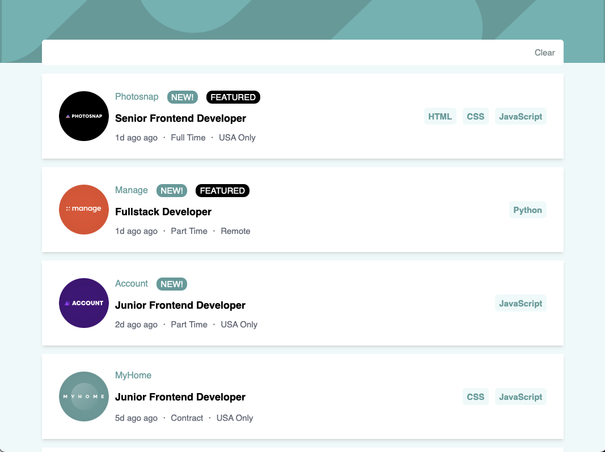

# Frontend Mentor - Job listings with filtering solution

> Weekly practice for layout and react.

This is a solution to the [Job listings with filtering challenge on Frontend Mentor](https://www.frontendmentor.io/challenges/job-listings-with-filtering-ivstIPCt). Frontend Mentor challenges help you improve your coding skills by building realistic projects.

## Table of contents

- [Overview](#overview)
  - [The challenge](#the-challenge)
  - [Screenshot](#screenshot)
  - [Links](#links)
- [My process](#my-process)
  - [Built with](#built-with)
- [Author](#author)
- [Acknowledgments](#acknowledgments)

## Overview

### The challenge

Users should be able to:

- View the optimal layout for the site depending on their device's screen size
- See hover states for all interactive elements on the page
- Filter job listings based on the categories

### Screenshot

### Links

- Solution URL: [https://github.com/Chious/fm-job-listings-app](https://github.com/Chious/fm-job-listings-app)
- Live Site URL: [https://fm-job-listings-app.vercel.app](https://fm-job-listings-app.vercel.app)

## My process

1. Finished RWD Layout (1h).

2. Finished `CardFilter`、filter Logic(0.5h).

### Built with

- Semantic HTML5 markup
- CSS custom properties
- Flexbox
- CSS Grid
- Mobile-first workflow
- [React](https://reactjs.org/) - JS library
- [Next.js](https://nextjs.org/) - React framework
- [Styled Components](https://styled-components.com/) - For styles

## Author

- Github - [Chious](https://github.com/Chious)
- Frontend Mentor - [@Chious](https://www.frontendmentor.io/profile/Chious)
